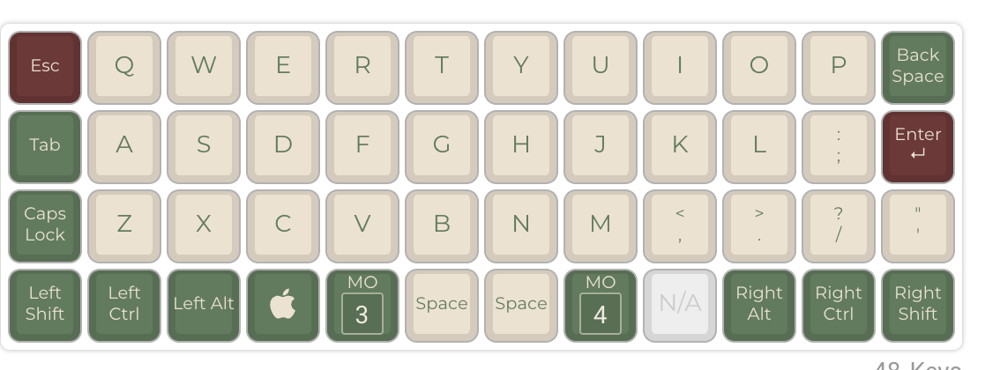
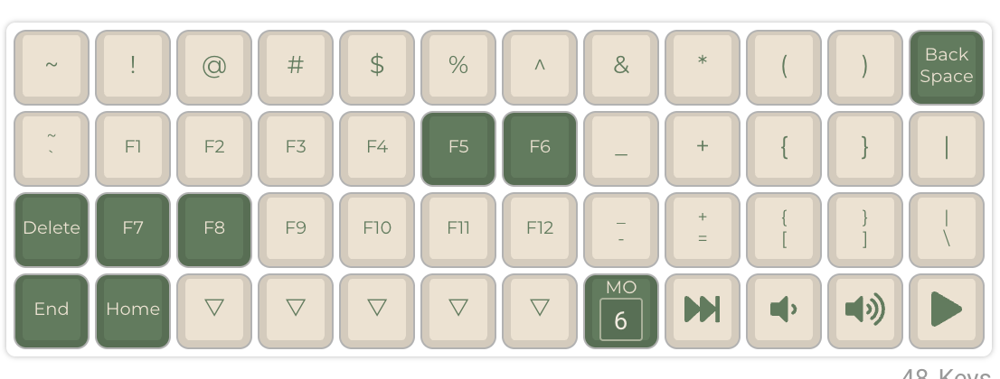
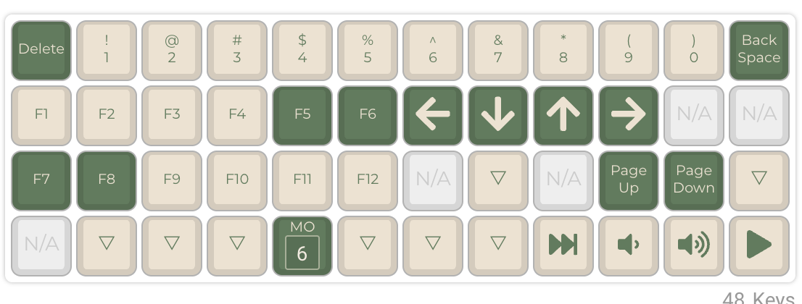

# Planck Rev7 Custom Firmware

This repository contains the custom firmware for your Planck Rev7 mechanical keyboard. It includes your personalized keymap created using the [QMK Configurator](https://config.qmk.fm/#/planck/rev7/LAYOUT_ortho_4x12).

## Custom Layout Screenshots
Below are screenshots of your custom keymap as configured in the [QMK Configurator](https://config.qmk.fm/#/planck/rev7/LAYOUT_ortho_4x12).

### Base Layer

### Layer 1

### Layer 2

---

Enjoy your custom Planck Rev7 keyboard layout! 🎉
